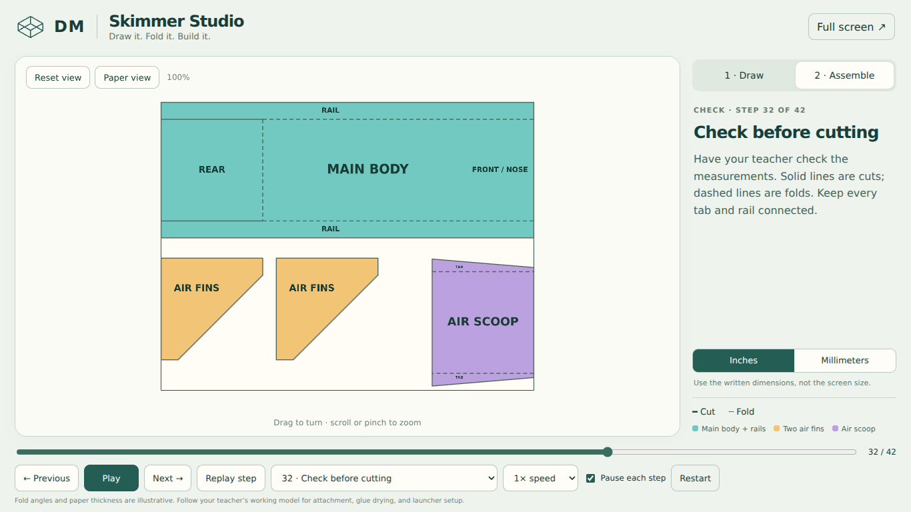
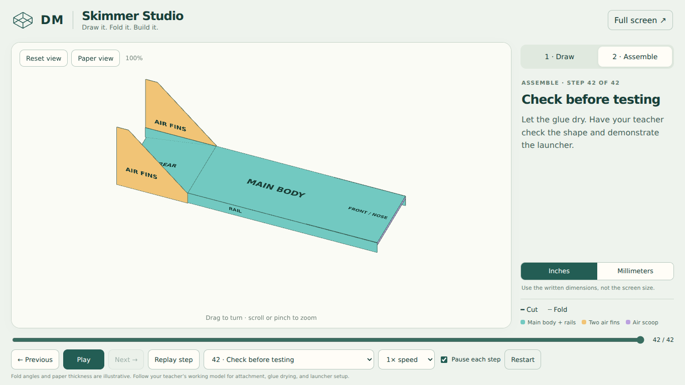
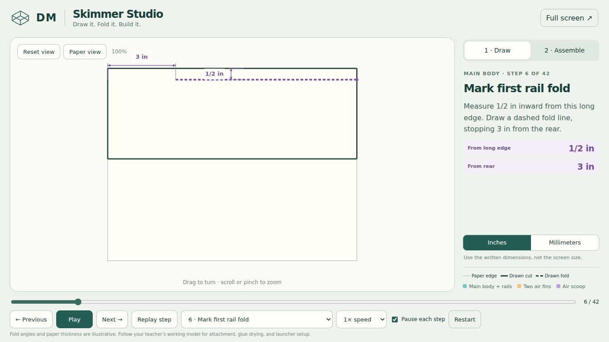
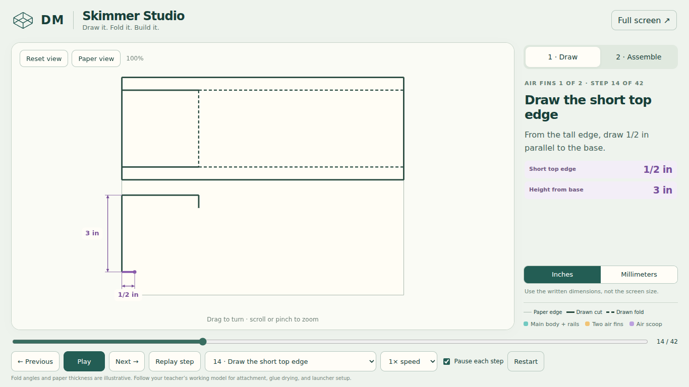

# DM Skimmer Studio verification

## Automated geometry checks

`node --test tests/model.test.cjs` — 7 tests pass.

- Dimensions match the existing measured model: body 11 × 4 in, rails 1/2 in, two matching air fins with 3 in extents, and a 3 × 3 in air scoop center.
- Exact fractional conversions include 1/8 in = 3.175 mm and 3/8 in = 9.525 mm; changing display units does not change geometry.
- Each of the 29 drawing strokes appears progressively from its starting endpoint; blank paper has no pre-drawn parts.
- Every drawing step has positive, geometrically accurate dimensions on both perpendicular paper axes, with named measurement rows. The rail offsets, air fin top/height, and all three air scoop tab dimensions have explicit checks.
- Every timeline boundary and sampled geometry/projection is finite.
- A conservative clear-space check samples the air scoop path every 0.005 source seconds: it remains outside the body or below the deck inside both rails. Its front edge finishes at the nose.
- All lettering vertices remain on the plane of their own part during every fold.
- Trackball math passes the poles and produces normalized rotations.

## Browser checks

`tests/browser-check.cjs` passes in Chromium 153 with WebGL enabled, including native touch events. The script accepts `SKIMMER_CHROMIUM_EXECUTABLE` when an existing Chromium binary is available; otherwise it uses Playwright's bundled browser. Install Playwright for development with `npm install --no-save playwright`, followed by `npx playwright install chromium`, then run `node tests/browser-check.cjs`. No development dependency is loaded by the student page.

Verified:

- All 42 stages render without browser exceptions.
- Play pauses at the next completed step; Replay returns to the same completed step. A near-boundary regression check prevents floating-point timing from skipping a pause.
- Continuous playback stops at the teacher measurement check; another Play continues into assembly.
- Wheel zoom, free mouse rotation, native two-touch pinch, pointer cleanup, keyboard rotation/zoom/reset, and fullscreen entry/exit work.
- The unit toggle updates the instruction and every measurement, including repeated values on different axes and the three air scoop values (3.175, 9.525, and 76.2 mm). All 42 steps have the expected number of visible measurement rows.
- Next, Previous, stage selection, reset, and phase navigation work.
- 1366 × 768, 1280 × 720, 1024 × 768, and 390 × 844 layouts were checked. The desktop layouts fit without page scrolling; the phone layout stacks the instruction below the model, without horizontal overflow.
- Screenshots were visually inspected for lettering, fold/cut styles, assembly orientation, measurement callouts, and mobile layout.

## Review limits

The check was in Chromium, not on the classroom's actual student devices. Confirm the merged link on school Wi-Fi. Paper thickness, folding, and adhesive joints are teaching illustrations; the teacher's physical working model remains the assembly reference. Labels are printed on both sides for readability; covered labels are hidden by WebGL depth testing. The basic Canvas fallback uses painter ordering and cannot provide the same exact occlusion for intersecting geometry.

## Previews

## Drawing refinements

Reviewed the rail placement, air fin top edge, and paper-edge examples, plus body outlines, rear slits/hinge, air fin base/diagonal, air scoop center, and both tab sides. Both axes remain visible, and drawn strokes are heavier than the paper boundary.

